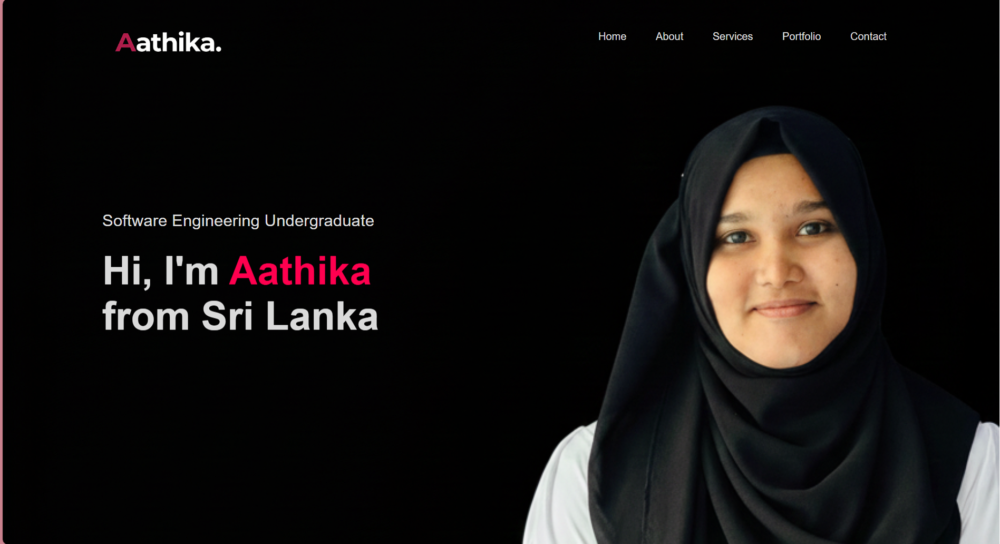

<h1 align="center">Hi there, I'm Aathika 👋</h1>

Passionate about building, learning, and sharing technology 
Always curious about full stack development, system design, and problem solving

---

## 👨‍💻 About Me
- 💻 Software Engineer Intern @IT Starter Pvt Ltd
- 🎓 Undergraduate Software Engineering Student
- 🔧 Interested in Full Stack Development and Backend Systems
- 🚀 Enjoy building real world  projects
- 📈 Focused on writing clean, scalable, and maintainable code

---

## 🛠️ Tech Stack

---

## 📊 GitHub Stats

---

## 🔗 Connect with Me

